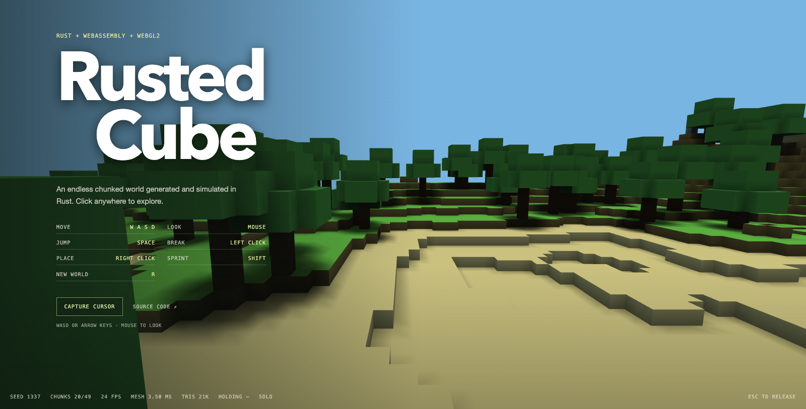
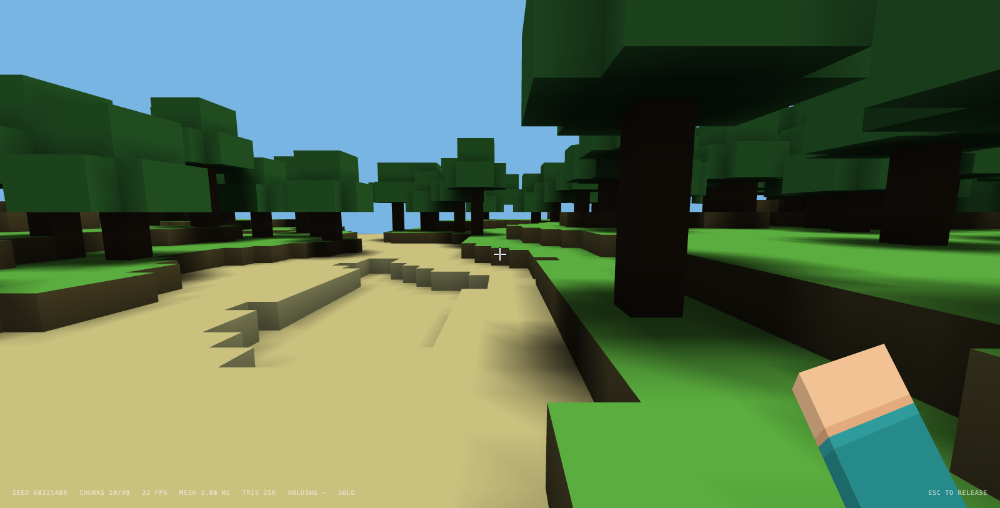

# Rusted Cube

A small voxel sandbox running in the browser. Terrain, game loop, physics,
collisions, raycasting and mesh building are Rust compiled to WebAssembly.
Rendering talks to WebGL2 directly, no Three.js.

**Play it: <https://antoinepoisson.github.io/Rusted-Cube>**



## What's in it

- Infinite chunked terrain from a hand-rolled Perlin implementation
- Ridged mountains gated by a low-frequency mask, so they stay local
- Trees that cross chunk borders without getting clipped
- Grass, dirt, sand, stone, snow, wood, leaves
- Per-vertex AO and vertical skylight, baked at mesh time
- Day/night cycle driving sun direction, sky color and fog
- Walk, jump, sprint, collide
- Break and place blocks with a DDA voxel raycast
- Optional LAN multiplayer with a bundled server
- Greedy meshing, one VBO per chunk, frustum culling
- FPS / mesh time / chunk count readout in the corner



## Running it

Needs Rust, the wasm32 target, wasm-pack and any static file server.

```sh
rustup target add wasm32-unknown-unknown
wasm-pack build --target web --release
python3 -m http.server 8080 --bind 127.0.0.1
```

Open http://localhost:8080 and click to grab the cursor.

Pushing to `main` or `prod` deploys the site linked at the top to GitHub Pages,
see the `website-RustedCube` workflow in `.github/workflows/`. CI pins Rust 1.76
because 1.82 changed the wasm ABI and broke the wasm-bindgen version this uses.
The deployed site is static, so it is single player only.

Pages has to be set to **Settings > Pages > Source: GitHub Actions**. Left on
"Deploy from a branch" it serves the repository as it is instead of what the
workflow builds, and since `pkg/` is gitignored the wasm module 404s: the page
paints, then sits on the loading screen forever.

## LAN play

Run the server in `server/` instead of the static one, it serves both the page
and the websocket:

```sh
wasm-pack build --target web --release
cd server && cargo run --release      # optional seed: -- 42
```

It prints the address to share. No dependencies, everything on std, one thread
per connection. Port 8118 because 8080 is always taken already.

The server prints the local address it can detect. If the machine has no default
network route, use its LAN IP directly.

The server owns the seed and the edit list, clients generate the terrain locally
from that seed, so only poses and edits travel. Behind a static host no socket
gets opened at all and the game stays single player. `R` is disabled online
since the world is shared.

## Controls

| | |
| --- | --- |
| Move | WASD or arrows |
| Look | mouse |
| Jump | space |
| Sprint | shift |
| Break | left click |
| Place | right click |
| New world | R, offline only |
| Free the cursor | escape |

On a touchscreen, the left stick walks (analog: a half push is a half speed),
the right stick turns the camera, dragging anywhere above the sticks also looks
around, and the action buttons jump, break and place.

Offline the seed is drawn at random on every load and shown in the corner
readout. Append `?seed=1337` to the URL to come back to a world you liked.

## Layout

```text
src/
  game.rs       browser events, frame loop
  input.rs      input state
  net.rs        websocket client
  perlin.rs     seeded 2D perlin + ridged noise
  player.rs     camera, movement, collisions
  protocol.rs   wire format
  renderer.rs   WebGL2, culling, shaders
  world.rs      chunks, terrain, lighting, raycast, meshing

server/
  main.rs       http, connection threads, world state
  websocket.rs  handshake and framing
  sha1.rs       only there for the handshake
```

## Notes

7x7 chunks around the player, 16x48x16 each. Edits are stored per chunk and
replayed when a chunk comes back.

Meshing reads a padded copy of the chunk plus its 8 neighbors, so it is 9
hashmap lookups and then plain array reads. Coplanar faces that shade the same
get merged. Faces carrying an AO gradient are emitted alone, stretching them
smears the gradient over the whole run.

Vertices are 2 u32 each: position + normal + AO in the first, material +
skylight in the second, unpacked in the vertex shader. Positions are chunk
local, the origin arrives as a uniform, and one index buffer is shared by every
chunk.

Chunk generation and meshing are both spread over frames, 8 chunks and 4ms of
meshing per call. Doing the whole 7x7 window in one go was a visible hitch on
load and every time the player crossed a chunk border.

No shadow mapping. The sun moves, cast shadows don't follow.

Benchmarks, native release on the full 49 chunk window:

```sh
cargo test --release -- --ignored --nocapture
```

Generation is ~73us per chunk. Greedy meshing emits 51% of the quads the plain
mesher does for 2.3x the CPU time, 11.5ms for the whole window against 5.1ms.
That trade is worth it here: meshing happens once per chunk and is spread over
frames, the quads are drawn every frame forever.

The renderer sizes its shared index buffer from `MAX_QUADS_PER_CHUNK`, which is
the densest mesh a chunk can hold: a 3D checkerboard, 36864 quads. A test builds
exactly that and checks the bound is tight.

## Not done

- Cast shadows
- Transparent blocks, would need depth sorting

## License

MIT
